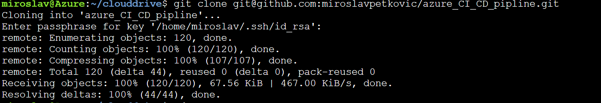
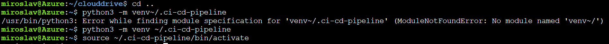

# Overview

This project details steps for building a Github repository and creating an application scaffolding for a Machine Learning Flask Web App, to perform both continuous integration and continuous delivery. First by using Github Actions to perform an initial test and then integrating the application with Azure Pipelines to enable continuous delivery to Azure App Service. . 

## Project Plan
The first step is to create a project plan detailing what the tasks are, goals, deadlines, level of difficulty for each task, the person who is responsible for each task etc. This is essential for tracking tasks and making sure that each outlined task is completed in a timely manner in order to ensure completion of all tasks by the target completion date. 

* A link to a Trello board for this project
 https://trello.com/b/rBTAIP7Q/build-a-ci-cd-pipeline-project

* A link to a spreadsheet that includes the original and final project plan>
https://docs.google.com/spreadsheets/d/1qpCGKQe1nXdEB18FjAw5xvyuGp2dEQqrv6jw8nJYfxs/edit?usp=sharing

## Instructions
### Setting up the Azure Cloud Shell
  1. Create a Github Repo and initialize it with a READMe file and add a gitignore for python and ensure it is integrated with Azure Pipelines. 
  
  
  2. Go to the Azure portal and open a terminal. 
  3. Create and activate a python virtual environment by running:
      `python3 -m venv~/.<yourreponame>`
       then
      `source ~/.<yourreponame>/bin/activate`
  4. Create an ssh key to communicate with Github by running:
      `ssh-keygen -t rsa`
  5. Open the .pub file using the cat command and copy the key in the file for example: 
      `cat </path>.ssh/id_rsa.pub`
  6. Go back to your github profile, under settings select SSH and GPG keys - paste the SSH key.
  7. Now you can do a git clone of the repo - hover over to your repo and click the code icon, select SSH and copy the SSH clone. 
  8. Go back to the Azure terminal and clone your repo by running
        `git clone<yoursshkey>`
      
      
      
   10. cd into your repo and you are ready for the next steps.
 
 ### Project Scaffolding - 
  The application scaffolding contains:
  * Makefile 
  * requirements.txt
  * python script (hello.py)
  * test file (hello_test.py)
    
  ### Local Continuous Integration setup
   1. First we need to do a local test to ensure that everything works. Once the scaffolding files are created, run `make all` on the azure terminal.
   2. This triggers the install, lint and test steps outlined in the makefile. (all the steps should pass)
   
      '''
      .ci-cd-pipeline) miroslav@Azure:~/clouddrive$ ls
      azure_CI_CD_pipline
      (.ci-cd-pipeline) miroslav@Azure:~/clouddrive$ cd azure_CI_CD_pipline/
      (.ci-cd-pipeline) miroslav@Azure:~/clouddrive/azure_CI_CD_pipline$ ls
      hello.py  Makefile  README.md  requirements.txt  screenshots  test_hello.py
      (.ci-cd-pipeline) miroslav@Azure:~/clouddrive/azure_CI_CD_pipline$ make all
      pip install --upgrade pip &&\
              pip install -r requirements.txt
      Cache entry deserialization failed, entry ignored
      Collecting pip
        Using cached https://files.pythonhosted.org/packages/fe/ef/60d7ba03b5c442309ef42e7d69959f73aacccd0d86008362a681c4698e83/pip-21.0.1-py3-none-any.whl
      Installing collected packages: pip
        Found existing installation: pip 18.1
          Uninstalling pip-18.1:
            Successfully uninstalled pip-18.1
      Successfully installed pip-21.0.1
      Collecting pylint
        Using cached pylint-2.7.4-py3-none-any.whl (346 kB)
      Collecting pytest
        Using cached pytest-6.2.2-py3-none-any.whl (280 kB)
      Collecting astroid<2.7,>=2.5.2
        Using cached astroid-2.5.2-py3-none-any.whl (222 kB)
      Collecting mccabe<0.7,>=0.6
        Using cached mccabe-0.6.1-py2.py3-none-any.whl (8.6 kB)
      Collecting toml>=0.7.1
        Using cached toml-0.10.2-py2.py3-none-any.whl (16 kB)
      Collecting isort<6,>=4.2.5
        Using cached isort-5.8.0-py3-none-any.whl (103 kB)
      Collecting lazy-object-proxy>=1.4.0
        Using cached lazy_object_proxy-1.6.0-cp37-cp37m-manylinux1_x86_64.whl (55 kB)
      Collecting typed-ast<1.5,>=1.4.0
        Using cached typed_ast-1.4.2-cp37-cp37m-manylinux1_x86_64.whl (743 kB)
      Collecting wrapt<1.13,>=1.11
        Using cached wrapt-1.12.1.tar.gz (27 kB)
      Collecting attrs>=19.2.0
        Using cached attrs-20.3.0-py2.py3-none-any.whl (49 kB)
      Collecting pluggy<1.0.0a1,>=0.12
        Using cached pluggy-0.13.1-py2.py3-none-any.whl (18 kB)
      Collecting importlib-metadata>=0.12
        Using cached importlib_metadata-3.10.0-py3-none-any.whl (14 kB)
      Collecting iniconfig
        Using cached iniconfig-1.1.1-py2.py3-none-any.whl (5.0 kB)
      Collecting packaging
        Using cached packaging-20.9-py2.py3-none-any.whl (40 kB)
      Collecting py>=1.8.2
        Using cached py-1.10.0-py2.py3-none-any.whl (97 kB)
      Collecting zipp>=0.5
        Using cached zipp-3.4.1-py3-none-any.whl (5.2 kB)
      Collecting typing-extensions>=3.6.4
        Using cached typing_extensions-3.7.4.3-py3-none-any.whl (22 kB)
      Collecting pyparsing>=2.0.2
        Using cached pyparsing-2.4.7-py2.py3-none-any.whl (67 kB)
      Using legacy 'setup.py install' for wrapt, since package 'wheel' is not installed.
      Installing collected packages: zipp, typing-extensions, wrapt, typed-ast, pyparsing, lazy-object-proxy, importlib-metadata, toml, py, pluggy, packaging, mccabe, isort, iniconfig, attrs, astroid, pytest, pylint
          Running setup.py install for wrapt ... done
      Successfully installed astroid-2.5.2 attrs-20.3.0 importlib-metadata-3.10.0 iniconfig-1.1.1 isort-5.8.0 lazy-object-proxy-1.6.0 mccabe-0.6.1 packaging-20.9 pluggy-0.13.1 py-1.10.0 pylint-2.7.4 pyparsing-2.4.7 pytest-6.2.2 toml-0.10.2 typed-ast-1.4.2 typing-extensions-3.7.4.3 wrapt-1.12.1 zipp-3.4.1
      pylint --disable=R,C,E1120,W0613 hello.py

      --------------------------------------------------------------------
      Your code has been rated at 10.00/10 (previous run: 10.00/10, +0.00)

      python -m pytest -vv test_hello.py
      ========================================================= test session starts =========================================================
      platform linux -- Python 3.7.3, pytest-6.2.2, py-1.10.0, pluggy-0.13.1 -- /home/miroslav/.ci-cd-pipeline/bin/python
      cachedir: .pytest_cache
      rootdir: /usr/csuser/clouddrive/azure_CI_CD_pipline
      collected 1 item

      test_hello.py::test_hello_subtract PASSED                                                                                       [100%]

      ========================================================== 1 passed in 1.01s ==========================================================
      (.ci-cd-pipeline) miroslav@Azure:~/clouddrive/azure_CI_CD_pipline$
      '''

      
  #### Continuous Integration - Github Actions
  Ensure that you track all the changes to your github repo by running `git status`, `git add .`, `git commit -m "message"` and `git push`.
  In this step you will configure Github Actions to perform continuous integration remotely. this ensures that your code is continuously tested everytime new changes are 
      made to your repository depending on the series of commands you specify in the github actions config. 
  1. On the Github profile navigate to your repo and select Actions - choose 'set up yourself' option.
  2. This creates a yml code which you can edit yourself
  3. Push the changes to Github - navigate back to your repo , then select Actions again and the github workflow should now appear - click on it and select the yml file.
  4. Then click on 'build' and this should run to verify the lint and test steps pass.
    
    
  ### Create Badge  
   You can create a status badge as well by selecting the create badge option, copy and paste the link to your readme. 
    
    
  ### Continuous Delivery - Azure Pipelines & Azure App Service
   1. On the Azure portal, navigate to Azure Devops organizations, and create a new project, under service connection ensure that its connected to your subscription and       resource group. 
   2. On the Azure terminal, create an app service and deploy your app:
          `az webapp up --sku F1 -n <yourappservicename>`
 
        **the name has to be unique
        To verify the deployed application on your browser go to
       `https://<your-appservice>.azurewebsites.net/` and you should see the words in the html part on the app.py file
       
      
   3. On the terminal, perform a prediction to ensure that everything is working by running 
        `./make_predict_azure_app.sh`
      If you get an error, run 
       `chmod +x make_predict_azure_app.sh` first
       
       This should output
       
      
   ##### Perfomance Testing of my ML API 
   In order to do test how many users my website can serve concurrently, I used Locust and tested 20 users at a hatch rate of 2 seconds. By the time I took the screenshot, 143 requests had been passed to my website and the API could effectively handle 4.6 requests per second (RPS). 
   Steps:
   1. In the command prompt (not in Azure cloud shell), install locust: `pip install locust`
   2. Navigate to your repo where the locustfile is stored using `cd <pathtorepo>` 
   3. run locust using your website url as a host. for example: `locust -f locustfile.py --host https://ml-flask-cicd.azurewebsites.net'
   4. The go to http://localhost:8089/ and enter the number of users and hatch rate you prefer and then start click on "start swarming"
   

       
   4. Inspect the logs of your application on your browser: `https://<app-name>.scm.azurewebsites.net/api/logs/docker`
   
       

   5. In your project page, select Pipeline and create a new Pipeline and connect to your Github repository.
   6. Configure Python to Linux Web App on Azure and select wep app name. 
   7. This will create a YAML file. Select Save and Run and this will commit the YAML file to your github repo and run the build and deploy job.
          
         
   8. Now that your continuous delivery is set up, you can push any changes to your github repo and this automatically triggers your pipeline to run and test - making sure that your project is always in a testable and deployable state which is the main point of continuous integration/ continuous delivery

   9. Once you are done, ensure to go back to your azure portal and delete all the resources you have created including the resource groups and the app services so that you do not incur additional costs. 
   
#### Architecture Diagram

   

## Enhancements

The project expectations were clearly outlined and the way the project was broken down into different categories helped to create an understanding on how each step relates to another. The machine learning prediction app was interesting as well. 

## Demo 

<Screencast link: https://www.screencast.com/t/RdmldxC7

