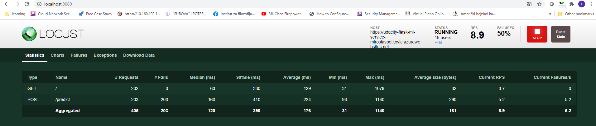

# Overview

This project details steps for building a Github repository and creating an application scaffolding for a Machine Learning Flask Web App, to perform both continuous integration and continuous delivery. First by using Github Actions to perform an initial test and then integrating the application with Azure Pipelines to enable continuous delivery to Azure App Service. . 

## Project Plan
The first step is to create a project plan detailing what the tasks are, goals, deadlines, level of difficulty for each task, the person who is responsible for each task etc. This is essential for tracking tasks and making sure that each outlined task is completed in a timely manner in order to ensure completion of all tasks by the target completion date. 

* A link to a Trello board for this project
https://trello.com/b/Kb08gLQl/cloud-devops-using-microsoft-azure-ci-cd-pipeline

* A link to a spreadsheet that includes the original and final project plan>
https://github.com/miroslavpetkovic/azure_CI_CD_pipeline/blob/main/project-management-Miroslav%20P.xlsx

## Instructions
### Setting up the Azure Cloud Shell
  1. Create a Github Repo and initialize it with a READMe file and add a gitignore for python and ensure it is integrated with Azure Pipelines. 
  
  
  2. Go to the Azure portal and open a terminal. 
  3. Create and activate a python virtual environment by running:
      `python3 -m venv~/.<yourreponame>`
       then
      `source ~/.<yourreponame>/bin/activate`
  4. Create an ssh key to communicate with Github by running:
      `ssh-keygen -t rsa`
  5. Open the .pub file using the cat command and copy the key in the file for example: 
      `cat </path>.ssh/id_rsa.pub`
  6. Go back to your github profile, under settings select SSH and GPG keys - paste the SSH key.
  7. Now you can do a git clone of the repo - hover over to your repo and click the code icon, select SSH and copy the SSH clone. 
  8. Go back to the Azure terminal and clone your repo by running
        `git clone<yoursshkey>`
      
      
      
   10. cd into your repo and you are ready for the next steps.
 
 ### Project Scaffolding - 
  The application scaffolding contains:
  * Makefile 
  * requirements.txt
  * python script (hello.py)
  * test file (hello_test.py)
    
  ### Local Continuous Integration setup
   1. First we need to do a local test to ensure that everything works. Once the scaffolding files are created, run `make all` on the azure terminal.
   2. This triggers the install, lint and test steps outlined in the makefile. (all the steps should pass)
   
   
      

      
  #### Continuous Integration - Github Actions
  Ensure that you track all the changes to your github repo by running `git status`, `git add .`, `git commit -m "message"` and `git push`.
  In this step you will configure Github Actions to perform continuous integration remotely. this ensures that your code is continuously tested everytime new changes are 
      made to your repository depending on the series of commands you specify in the github actions config. 
  1. On the Github profile navigate to your repo and select Actions - choose 'set up yourself' option.
  2. This creates a yml code which you can edit yourself
  3. Push the changes to Github - navigate back to your repo , then select Actions again and the github workflow should now appear - click on it and select the yml file.
  4. Then click on 'build' and this should run to verify the lint and test steps pass.
    
    
    
    
   #### Continuous Delivery - Azure Pipelines & Azure App Service

   1. Set up a python virtual environment and activate it.  In this this example it's named 'cicd-pipeline-web'.  
   

   2 Build the project.
   ```bash
   cd flask-sklearn
   make all
   ```
  

   3. Run the microservice 'locally' (i.e. in the Cloud Shell).
   
   
    4. Deploy, run and test the microservice in Azure App Services.  
   This will make it available over the internet.  Equally important, it will implicitly create a VM.  In a moment, this will become the target for the CD pipeline to deploy its content _to_.
    1. Back in the main Cloud Shell, `export FLASK_APP=app.py`, so flask knows what to run in the Azure App.
    2. Pick a name for your microservice.  This name will appear in the publicly available URL.
    3. Replace `<yourappname>` in `make_predict_azure_app.sh`
    4. Create the resource group and VM, upload the contents of the current directory and launch flask with `az webapp up`.  You will use the name for this command as well.  (here it's `udacity-flask-ml-service`)
    
    

   Check(list):**  `az webapp up` did quite a few things behind the scenes, so there are a few things to check for
    - The output contains the message `You can launch the app at ...`
    - The output prints out JSON, and it contains the string `"sku": "FREE"`
    - Hitting the website with `curl` produces the same HTML output it did in the previous step, when the service was run 'locally'.
    - Running `./make_predict_azure_app.sh` responds with JSON.

   5. In the second command window, tail the logs of the running Azure App with `azure webapp log tail`, e.g.

   ```bash
   az webapp log tail --resource-group miroslavpetkovic_rg_Linux_westeurope -n udacity-flask-ml-service-miroslavpetkovic
   ```
   Check:** Back in the main Cloud Shell, run `./make_predict_azure_app.sh`.  The request should be logged in the second Cloud Shell.
   
   
   #### Load test an application using Locust (swarm the target website from localhost)


   - Running `pip install locust` to install `locust`
   - Open browser and go to [http://localhost:8089/](http://localhost:8089/)
    
     
     
     
     
     

## Architecture Diagram


## Enhancements

This is a basic Azure DevOps project that demonstrates a CI/CD pipeline for testing and deploying a Machine Learning application.

Additional features should be taken into account in a commercial application,such as:

* Separate development and production environment
* Restricted permissions for the developers and the DevOps engineers.
* More tests
* Fault tolerant design
* Use a faster VM for the web app


## Demo 

 [YouTube video](https://youtu.be/gyZZhMOUzdo).
     
 
